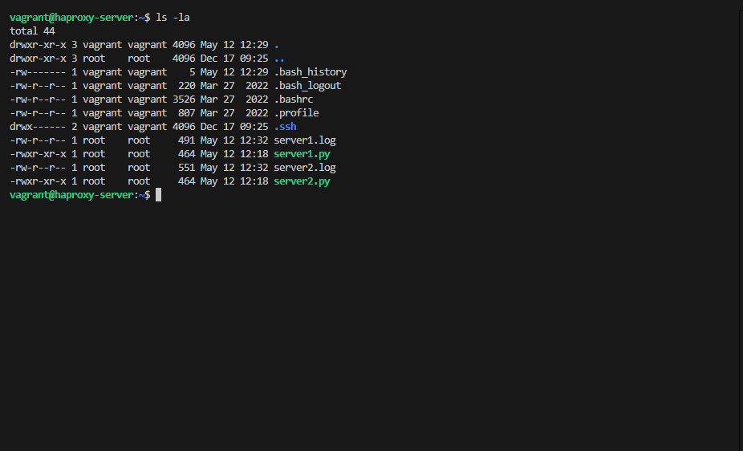

# Домашнее задание к занятию «Кластеризация и балансировка нагрузки»

## Задание 1. Балансировка Round-robin на 4 уровне

### Задача
1. Запустить два simple python сервера на виртуальной машине на разных портах
2. Установить и настроить HAProxy
3. Настроить балансировку Round-robin на 4 уровне

### Выполнение

Настроена балансировка с помощью HAProxy между двумя серверами:
- Сервер 1: 127.0.0.1:8888
- Сервер 2: 127.0.0.1:9999

Конфигурация HAProxy реализована в файле [haproxy_server1.cfg](fail/haproxy_server1.cfg):
```
frontend example
        mode tcp
        bind :8088
        default_backend web_servers

backend web_servers
        mode tcp
        balance roundrobin
        server s1 127.0.0.1:8888 check
        server s2 127.0.0.1:9999 check
```

### Результаты тестирования

1. 
   *Скриншот запущенного сервера*

2. 
   *Результат первого тестового запроса*

3. .png)
   *Результат второго тестового запроса*

4. 
   *Логи балансировки запросов между серверами*

## Задание 2. Балансировка Weighted Round Robin на 7 уровне

### Задача
1. Запустить три simple python сервера на виртуальной машине на разных портах
2. Настроить балансировку Weighted Round Robin на 7 уровне со следующими весами:
   - Сервер 1: вес 2
   - Сервер 2: вес 3
   - Сервер 3: вес 4
3. Настроить HAProxy для балансировки только http-трафика, адресованного домену example.local

### Выполнение

Настроена балансировка с помощью HAProxy между тремя серверами:
- Сервер 1: 127.0.0.1:8001 (вес 2)
- Сервер 2: 127.0.0.1:8002 (вес 3)
- Сервер 3: 127.0.0.1:8003 (вес 4)

Конфигурация HAProxy реализована в файле [haproxy_server2.cfg](fail/haproxy_server2.cfg):
```
frontend http_front
        bind :8080
        mode http
        
        # Проверка на домен example.local
        acl is_example_local hdr(host) -i example.local
        
        # Если домен example.local, то используем бэкенд с балансировкой
        use_backend weighted_servers if is_example_local
        
        # Для всех остальных запросов - дефолтный ответ
        default_backend default_server

backend weighted_servers
        mode http
        balance roundrobin
        option httpchk
        http-check send meth GET uri /
        
        # Настройка весов: 2, 3, 4
        server s1 127.0.0.1:8001 check weight 2
        server s2 127.0.0.1:8002 check weight 3
        server s3 127.0.0.1:8003 check weight 4
```

### Результаты тестирования


*Результаты тестирования балансировки с разными весами серверов*

